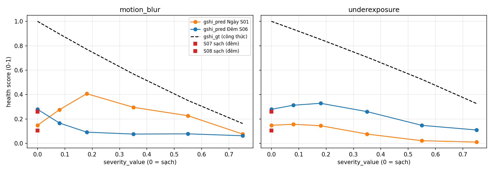

# Seahorse · Sensor Reality Sprint

Bài LAB **T1 — Camera degradation health score**: đo tác động của motion blur và thiếu sáng lên chất lượng ảnh camera trong bối cảnh xe ADAS, kiểm tra health score của **PerceptionHealthNet**, và đề xuất cách giám sát đầu vào camera dựa trên bằng chứng benchmark.

**Đội trưởng:** Lưu Quang Khải — MSSV **2A202602599**. Nhóm thực tế có **4 thành viên**, dùng chung [repository](https://github.com/luuquangkhai9/K4-Track4-Day04-Seahorse-Sensor-Reality-Sprint) và mỗi người nộp báo cáo riêng trên VLearn.

> Hướng dẫn LAB yêu cầu đúng 5 người. Nhóm cần xác nhận với giảng viên cách xử lý quy mô 4 người; thông tin trong repository chưa thay thế xác nhận này.

## 1. Problem — Camera suy giảm thì health score thay đổi ra sao?

Camera ADAS có thể cung cấp ảnh nhòe hoặc thiếu sáng dù vẫn hoạt động. Nhóm kiểm tra hai lỗi **motion blur** và **underexposure** trên các biến thể của cùng cảnh trong DRIVE-C. Tính năng liên quan là giám sát chất lượng ảnh trước khi đưa vào thuật toán nhận diện đối tượng.

**Giả thuyết ban đầu:** Khi blur tăng trên cùng cảnh/frame, blur score và health score dự kiến giảm. Khi thiếu sáng tăng, entropy, tỷ lệ pixel ở hai đầu thang sáng và health score có thể thay đổi. Phép thử kiểm tra các giả thuyết này, bao gồm trường hợp kết quả trái dự đoán.

Baseline là clip **clean của cùng cảnh**, nghĩa là không chủ động thêm corruption. Clean không đồng nghĩa ảnh hoàn hảo. Nhóm chưa chạy object detector nên các số đo ở đây là **proxy chất lượng đầu vào**, chưa chứng minh mức giảm mAP hay độ tin cậy của toàn bộ hệ thống ADAS.

## 2. Method — Nguồn và phương pháp

Nhóm dùng checkpoint có sẵn của PerceptionHealthNet, **không huấn luyện lại**. Theo [tài liệu mô hình của nguồn](https://github.com/shiv-aher/drive-c-dataset/blob/v1.0.1/docs/baseline_model.md), model dùng EfficientNet-B2 cùng các head dự đoán loại lỗi, severity, health và pixel map; checkpoint được huấn luyện trên ảnh KITTI với degradation tổng hợp. DRIVE-C là dữ liệu đánh giá ngoài tập huấn luyện đó.

| Thành phần | Cấu hình của phép thử |
| --- | --- |
| Code nguồn | [shiv-aher/drive-c-dataset](https://github.com/shiv-aher/drive-c-dataset/tree/v1.0.1) |
| Phiên bản | Tag `v1.0.1`, commit `caf16657b87cec8518008b74c72dd0dcb6088eb6` |
| Dataset | [DRIVE-C, phiên bản Zenodo 19656444](https://doi.org/10.5281/zenodo.19656444) |
| Checkpoint | `checkpoints/epoch_021_best.pth` |
| SHA-256 checkpoint | `c210d9a4f207584687583d1ab5b96a99e12b2f3dbb2727464c6c039e44fb8c0b` |
| Input model | RGB, resize trực tiếp về 384 × 1280, chia 255, CHW |
| Sampling | 8 frame/clip: 0, 18, 36, 54, 73, 91, 109, 127 |
| Output sử dụng | Health từng frame, trung bình health của clip; dự đoán loại lỗi/severity để tham khảo |
| Metric thủ công | Đo trên frame 54 ở kích thước gốc 1280 × 720 |

Notebook tái sử dụng các hàm đọc frame, tiền xử lý và nạp model của tác giả. Checkpoint được kiểm tra hash và nạp với `strict=True`; inference ở chế độ eval.

**Quy ước bằng chứng:**

- **[NGUỒN]:** `gshi_pred_author` và kết luận trong paper/repository tác giả.
- **[NHÓM ĐO]:** output inference và các metric trong notebook/CSV của dự án.
- **[GIẢ THUYẾT]:** giải thích nguyên nhân hoặc tác động tới tính năng chưa được kiểm chứng.

Theo [định nghĩa GSHI của nguồn](https://github.com/shiv-aher/drive-c-dataset/blob/v1.0.1/docs/gshi_definition.md), `gshi_gt` là nhãn tham chiếu tính từ severity, không phải phép đo độc lập về sensor health hoặc độ đúng của detector. `gshi_pred` là output model trên thang 0–1, được diễn giải là health cao hơn khi giá trị lớn hơn.

## 3. Benchmark — Dữ liệu, metric và cách chạy

### Thiết kế có đối chứng

| Cảnh | Điều kiện | Số clip |
| --- | --- | ---: |
| S01 — ngày | Clean + 5 mức motion blur + 5 mức underexposure | 11 |
| S06 — đêm | Clean + 5 mức motion blur + 5 mức underexposure | 11 |
| S07, S08 — đêm | Clean, dùng làm ví dụ bổ sung | 2 |
| **Tổng** | | **24** |

- Motion blur: kernel **11, 13, 19, 27, 33 px**.
- Underexposure: `delta_ev` **−0,16; −0,36; −0,70; −1,10; −1,50**, theo metadata nguồn.
- Mỗi phép so sánh giữ nguyên scenario, frame và pipeline; chỉ thay một loại corruption ở từng mức.
- Có **192 output health từng frame** (24 × 8), và **24 ảnh frame 54** cho bảng metric thủ công. Các frame cùng clip không phải mẫu cảnh độc lập.
- S07/S08 không làm baseline cho các điều kiện lỗi của S01/S06. So sánh ngày/đêm giữa hai cảnh chỉ là quan sát, không tách được tác động riêng của thời điểm khỏi nội dung cảnh.

### Định nghĩa metric

| Metric/cột CSV | Cách tính | Đơn vị và cách diễn giải |
| --- | --- | --- |
| `B` | Phương sai `cv2.Laplacian(gray, cv2.CV_64F)`, gray uint8 | Phương sai đáp ứng Laplacian trên thang pixel 0–255; proxy độ sắc nét, không phải đại lượng vật lý |
| `S_pct` | `100 × mean((gray >= 250) OR (gray <= 5))` | % pixel ở hai đầu thang sáng, gồm cả pixel rất tối |
| `H_bit` | `−Σ p log₂(p)`, histogram grayscale 256 bin | bit; entropy mức xám |
| `gshi_pred_f54` | Health model dự đoán cho frame 54 | Không đơn vị, thang 0–1 |
| `gshi_pred_tb8` | Trung bình health của 8 frame/clip | Dùng đối chiếu với dự đoán clip của nguồn |

`B` phụ thuộc texture, exposure và độ phân giải; `S_pct` cao có thể do cảnh tối tự nhiên; entropy không có một chiều tốt/xấu chung cho mọi corruption. Ba metric thủ công chưa được chuẩn hóa thành một health score tổng hợp. `top1_prob` là xác suất của model chẩn đoán lỗi camera, không phải confidence của object detector.

### Chạy trên Kaggle

Đường chạy chính là [test-drivec.ipynb](test-drivec.ipynb). Notebook có output của lần chạy đã lưu; các kết quả dưới đây lấy từ artifact đó, không phải một lần inference mới khi viết README.

1. Upload notebook lên Kaggle, bật **Internet** trong Session options.
2. Chọn CPU hoặc GPU tương thích với PyTorch của session. Lần chạy lưu trong notebook dùng **CPU, PyTorch 2.11.0+cpu**.
3. Kiểm tra môi trường có `torch`, `torchvision`, `numpy`, `pandas`, `matplotlib`, `cv2`, `yaml` và `requests`. Notebook tự cài `remotezip`; phiên bản môi trường nguồn nằm trong [requirements của tác giả](https://github.com/shiv-aher/drive-c-dataset/blob/v1.0.1/requirements.txt).
4. Chạy tuần tự các cell hoặc **Run All**. Notebook clone tag đã chốt, kiểm tra checkpoint và chỉ tải 24 clip cần dùng qua HTTP Range, khoảng **170 MB** theo log hiện có.
5. Kiểm tra cell **“Kiểm tra pipeline có đúng không”**: trung bình 8 frame được so với `gshi_pred` trong metadata nguồn. Nếu chênh lệch vượt ngưỡng kiểm tra `1e-3`, kiểm tra checkpoint, sampling và tiền xử lý trước khi dùng kết quả.
6. Tải CSV, hash và các hình từ `/kaggle/working`; lưu notebook cùng output và thông tin môi trường của lần chạy mới.

Nếu thiếu thư viện trong Kaggle, có thể cài các thư viện phụ trợ bằng một cell trước phần nạp model:

```python
%pip install remotezip numpy pandas matplotlib opencv-python-headless pyyaml requests
```

Đây là lệnh setup tiện dụng; để tái lập môi trường, cần lưu phiên bản thực tế sau khi cài. Không tự thay PyTorch đang hoạt động nếu chưa có lỗi tương thích.

### Chạy trên máy cá nhân

Mở notebook bằng Jupyter hoặc VS Code, chọn kernel đã cài các dependency trên và có kết nối Internet. Chạy từ thư mục dự án. Khi không có `/kaggle/working`, notebook dùng `./kaggle_work` để lưu code tải về, dữ liệu và output. GPU không bắt buộc; notebook tự chọn CUDA nếu khả dụng, nếu không dùng CPU.

Notebook dùng bản nguồn tại `<WORK>/drive-c-dataset`; thư mục `drive-c-dataset/` ở gốc dự án là bản nguồn để tham khảo, không tự động là bản mà notebook chạy. Nếu thư mục clone trong WORK đã tồn tại, kiểm tra commit thực tế được in trong log vì notebook không tự checkout lại tag ở mỗi lần chạy.

Nếu Zenodo hoặc HTTP Range gặp lỗi, kiểm tra kết nối và chạy lại cell tải. Không thay ảnh hoặc tham số mà vẫn giữ nhãn kết quả cũ. Đường benchmark mô phỏng dự phòng được mô tả trong [kế hoạch LAB](LAB_COMPLETION_PLAN.md).

### Kết quả đã lưu

Các số sau lấy từ [phn_24_results.csv](phn_24_results.csv), cùng frame 54 của S01:

| Điều kiện | B | S_pct (%) | H_bit (bit) | Health frame 54 |
| --- | ---: | ---: | ---: | ---: |
| Clean | 3544,1 | 1,7 | 7,52 | 0,1488 |
| Motion blur — kernel 11 px | 292,7 | 1,1 | 7,41 | 0,2760 |
| Motion blur — kernel 13 px | 199,5 | 0,9 | 7,40 | 0,4075 |
| Motion blur — kernel 19 px | 81,8 | 0,7 | 7,38 | 0,2960 |
| Motion blur — kernel 27 px | 25,8 | 0,5 | 7,40 | 0,2270 |
| Motion blur — kernel 33 px | 14,3 | 0,5 | 7,38 | 0,0766 |



Trong plot, đường `gshi_gt` là **nhãn từ công thức nguồn**; không phải kết quả nhóm đo về độ tin cậy của detector.

Notebook lưu chênh lệch tối đa khoảng **6,26 × 10⁻⁴** khi đối chiếu trung bình 8 frame với metadata nguồn. Tính lại từ CSV từng frame và cột nguồn đã làm tròn cho khoảng **5,99 × 10⁻⁴**. Khác biệt này do độ chính xác của dữ liệu đối chiếu. Kết quả nằm dưới ngưỡng kiểm tra notebook, hỗ trợ tính nhất quán của lần tái hiện; chưa chứng minh model đánh giá đúng sensor health.

## 4. Failure case — Health tăng dù ảnh nhòe hơn

**[NHÓM ĐO]** Với S01 frame 54, motion blur kernel 13 px làm `B` giảm từ **3544,1 xuống 199,5**, khoảng **94,4%**, nhưng health tăng từ **0,1488 lên 0,4075**. Ở kernel 33 px, health mới giảm xuống **0,0766**. Health không giảm đơn điệu theo mức blur trong trường hợp này.

Đây là failure case của cách dùng health score để phản ánh mức corruption: ảnh bị blur nhẹ hơn hoặc mạnh hơn chưa chắc được model xếp theo thứ tự dự kiến. Cần bổ sung ảnh clean/degraded cùng frame để đối chiếu trực quan khi trình bày. Notebook có cell xuất `phn_grid.png`, nhưng file này chưa có trong thư mục gốc tại thời điểm viết README.

**[GIẢ THUYẾT]** Sự phụ thuộc nội dung cảnh hoặc khác biệt giữa dữ liệu huấn luyện và dữ liệu đánh giá có thể góp phần gây kết quả này; nhóm chưa kiểm chứng nguyên nhân. Không suy ra detector sẽ giảm một tỷ lệ cụ thể vì chưa đo detector.

Giới hạn của benchmark:

- Chỉ hai cảnh có đầy đủ corruption và một frame/clip cho metric thủ công; chưa đủ để khái quát cho mọi camera/ngày đêm.
- Corruption được tạo có kiểm soát trên video, chưa đại diện đầy đủ cho lỗi sensor ngoài thực tế.
- Nhãn GSHI được xây dựng từ severity; không là ground truth vật lý hoặc ground truth chất lượng nhận diện đối tượng.
- Health frame 54 khác trung bình 8 frame; phải so cùng cách tổng hợp.
- Chưa đo mAP, latency end-to-end, hiệu quả fusion hoặc mức cảnh báo nhầm trên một tập kiểm tra độc lập.

## 5. Engineering decision — Giám sát nhiều metric trước khi chọn ngưỡng

**Đề xuất:** Ghi log health cùng `B`, `S_pct`, `H_bit` và thông tin ngữ cảnh; đánh dấu các trường hợp bất đồng để kiểm tra trước khi chọn quy tắc giảm trọng số camera. Chưa chọn một ngưỡng health tuyệt đối áp dụng cho mọi cảnh từ benchmark nhỏ này.

Trade-off: metric thủ công dễ tính nhưng phụ thuộc cảnh và ánh sáng; model health cho thêm tín hiệu nhưng vẫn có trường hợp không theo mức lỗi dự kiến. Quy tắc theo ngày/đêm hoặc theo ngữ cảnh cần thêm dữ liệu và kiểm tra cảnh báo nhầm.

**Phép thử tiếp theo:** Thu thập nhiều cảnh sạch/lỗi, chọn ngưỡng trên tập dev rồi đánh giá trên tập khác; đo tỷ lệ cảnh sạch bị cảnh báo và lỗi bị bỏ sót. Nếu muốn kết luận về ảnh hưởng tới ADAS, chạy detector với cấu hình cố định và nhãn đối tượng phù hợp. Cải tiến này là đề xuất, chưa được triển khai hoặc benchmark trong kết quả hiện có.

## Tổ chức repository và phân công

| File | Nội dung |
| --- | --- |
| [T1_camera_degradation_health_score.md](T1_camera_degradation_health_score.md) | Chủ đề và yêu cầu T1 |
| [LAB_COMPLETION_PLAN.md](LAB_COMPLETION_PLAN.md) | Kế hoạch 120 phút, đầu ra và checklist rubric |
| [test-drivec.ipynb](test-drivec.ipynb) | Setup, inference, kiểm tra tái hiện và trực quan hóa |
| [phn_24_results.csv](phn_24_results.csv) | Bảng 24 ảnh với health và ba metric thủ công |
| [phn_per_frame.csv](phn_per_frame.csv) | 192 output health từng frame |
| [phn_curve.png](phn_curve.png) | Plot health theo mức lỗi |
| [fetch_sha256.txt](fetch_sha256.txt) | Hash của 24 clip; không thay thế dữ liệu hoặc ảnh minh chứng |
| `drive-c-dataset/` | Bản code/tài liệu nguồn địa phương |

| Thành viên | Vai trò | Tài liệu công việc |
| --- | --- | --- |
| Lưu Quang Khải — 2A202602599 | Đội trưởng, tổng hợp và quyết định kỹ thuật | [File cá nhân](01_LuuQuangKhai_2A202602599.md) |
| Chưa điền tên/MSSV | Đọc nguồn và kiểm tra cơ sở phương pháp | [Template thành viên 2](02_Thanh_vien_Tai_lieu.md) |
| Chưa điền tên/MSSV | Code và chạy benchmark | [Template thành viên 3](03_Thanh_vien_Code_Benchmark.md) |
| Chưa điền tên/MSSV | Kiểm tra kết quả, plot và trình bày | [Template thành viên 4](04_Thanh_vien_Ket_qua_Trinh_bay.md) |

Các template phân công ban đầu có thiết kế Gaussian blur đề xuất. Cấu hình benchmark thực tế trong README là **motion blur/underexposure của DRIVE-C**; cần đồng bộ template khi hoàn thiện hồ sơ.

## Hoàn thiện và nộp bài

Benchmark đã có notebook output, CSV và plot. Để hoàn thành bài LAB, nhóm còn cần:

- [ ] Điền họ tên/MSSV của 3 thành viên và tạo `TEAMMATES.md` ở gốc; xác nhận quy mô nhóm với giảng viên.
- [ ] Lưu ảnh trước/sau cùng frame, ví dụ `phn_grid.png`, và kiểm tra đường dẫn bằng chứng.
- [ ] Ghi môi trường/lệnh chạy thực tế và hoàn thiện ghi chú paper/repository đã đọc.
- [ ] Hoàn thiện 4 báo cáo/slide cá nhân, mỗi bản đủ Problem → Method → Benchmark → Failure case → Engineering decision, dẫn bằng chứng chung.
- [ ] Tập pitch **3–5 phút**, tự đối chiếu rubric: **40% benchmark, 25% failure, 20% thuật toán, 15% trade-off**.
- [ ] Mỗi người nộp bản riêng cùng URL repository trên VLearn, rồi mở lại để kiểm tra truy cập.

Code/checkpoint/dataset nguồn thuộc dự án DRIVE-C; khi chia sẻ lại cần tuân thủ giấy phép và điều kiện sử dụng tương ứng của nguồn. Kết quả LAB trình bày ở đây thuộc phạm vi phép thử nhóm đã lưu.
