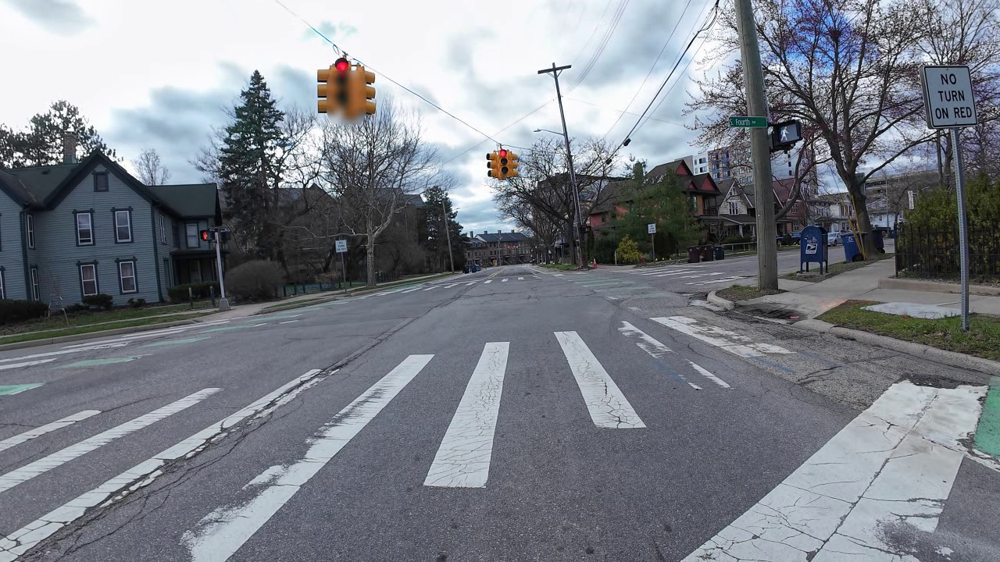

# Giai đoạn 2 — Nguồn, môi trường và baseline smoke test

**Ngày:** 05/10/2026, Asia/Bangkok.  
**Trạng thái:** Đạt đường chạy tối thiểu trên CPU; sẵn sàng triển khai benchmark đầy đủ ở giai đoạn 3.

## 1. Công việc hoàn thành

- Hoàn thiện [PAPER_CODE_MAPPING.md](../reports/PAPER_CODE_MAPPING.md): vai trò hai bài, input/output, công thức nhãn, nhánh health trực tiếp, khác biệt training loss/taxonomy, số liệu và limitation.
- Xác minh clone riêng ở đúng commit `caf16657b87cec8518008b74c72dd0dcb6088eb6`, không có thay đổi tracked. Các file quan trọng khớp bản source sao chép ở gốc.
- Import thành công PyTorch/torchvision/OpenCV/remotezip trên CPU; không cần GPU để chạy smoke test.
- Tải **riêng S01 clean**, kiểm tra SHA-256 khớp manifest dữ liệu đã lưu, kiểm tra video 128 frame, 1280 × 720, 30 FPS.
- Nạp strict checkpoint đã kiểm tra hash; sử dụng hàm sampling/preprocessing/inference của source.
- Chạy mới một batch 8 frame, lưu health từng frame, ảnh frame 54 và provenance. Không ghi đè các CSV 24 clip của lần chạy cũ.

## 2. Kết quả mới [NHÓM ĐO]

| Kiểm tra/metric | Kết quả |
| --- | --- |
| Clip | S01_clean |
| Frame sampled | 0, 18, 36, 54, 73, 91, 109, 127 |
| Health frame 54 | **0,1487695575** |
| Health trung bình 8 frame | **0,2219791263** |
| Health cấp clip trong metadata tác giả [NGUỒN] | **0,221905** |
| Chênh lệch tuyệt đối | **0,0000741263**, dưới ngưỡng `0,001` |
| B, frame 54 | 3544,1383649 |
| S_pct, frame 54 | 1,65581597% |
| H_bit, frame 54 | 7,51518294 bit |
| Nạp model, gồm dummy forward khởi tạo head | 1,52 giây |
| Forward batch 8 frame | **3,62 giây**, CPU 4 thread |
| Tải clip | Khoảng 125 giây, 24,44 MB; phụ thuộc mạng |

Kết quả hỗ trợ việc tái hiện pipeline trên một clean clip, không chứng minh model health chính xác trên mọi ảnh. Health thấp của clean không được tự diễn giải thành tình trạng an toàn thực của xe.

## 3. Môi trường thực sự đã chạy

Python **3.13.15**, PyTorch **2.14.1+cpu**, torchvision **0.29.1**, NumPy **2.5.3**, OpenCV headless **5.0.0.93**, remotezip **0.12.6**, requests **2.34.2**, PyYAML **6.0.3**. Đây là môi trường máy hiện tại, khác môi trường source đã audit; baseline vẫn đạt kiểm tra sai lệch. Chi tiết và source/data hash nằm trong manifest.

**Quyết định compute:** Tiếp tục CPU ở giai đoạn 3. Nhân thời gian một batch cho 24 clip cho khoảng **86,8 giây forward-only**, chưa gồm tải, decode, setup hoặc xuất ảnh; đây là ước lượng từ một clip, không phải runtime benchmark 24 clip. Hiện chưa cần người dùng chạy trên Colab/Kaggle.

## 4. Bằng chứng có thể mở

- [run_manifest.json](../outputs/stage2/run_manifest.json): trạng thái, môi trường, source/checkpoint/video hash, cấu hình, timing và số đo.
- [run.log](../outputs/stage2/run.log): các bước và kết quả kiểm tra.
- [baseline_per_frame.csv](../outputs/stage2/baseline_per_frame.csv): tám output health không làm tròn.
- [S01_clean_f54.png](../outputs/stage2/S01_clean_f54.png): ảnh baseline đúng frame.
- [Script smoke test](../scripts/stage2_smoke_test.py): đường chạy lại.



## 5. Chạy lại và setup ở một bản checkout mới

Chạy từ thư mục gốc, với source/cache hiện tại:

```powershell
python scripts/stage2_smoke_test.py --threads 4
```

Script tự sử dụng CUDA nếu có; trên máy hiện tại dùng CPU. Output cố định ở `outputs/stage2/` sẽ được cập nhật khi chạy lại. Muốn giữ riêng lần cũ, truyền `--output outputs/stage2_repeat`.

Nếu clone source chưa có, tạo bản riêng đúng tag; checkpoint mặc định lấy từ bản nguồn ở gốc dự án:

```powershell
git clone --depth 1 --branch v1.0.1 --filter=blob:none --sparse https://github.com/shiv-aher/drive-c-dataset.git .lab_cache/drive-c-source
git -C .lab_cache/drive-c-source sparse-checkout set src scripts simulation configs dataset docs
python scripts/stage2_smoke_test.py --threads 4
```

Nếu clone source đã tồn tại, kiểm tra commit bằng `git -C .lab_cache/drive-c-source rev-parse HEAD`; không tự dùng commit của repository nhóm thay thế. Script từ chối source sai commit hoặc tracked files đã sửa. Checkpoint phải có đúng hash trước khi load; có thể chỉ định đường dẫn khác bằng `--checkpoint`.

Trên môi trường mới, cần PyTorch/torchvision tương thích cùng numpy, opencv-python-headless, remotezip, requests, PyYAML. Notebook đầy đủ còn dùng pandas/matplotlib. Không cài nguyên requirements CUDA của tác giả vào máy CPU chỉ để chạy inference; lưu versions thực tế và kiểm tra baseline.

## 6. Bàn giao giai đoạn 3

**Cập nhật theo yêu cầu nhóm:** Giai đoạn 3 đã thu nhỏ và chạy thành công **4 clip S01 clean + blur s1/s2/s5**. Không còn yêu cầu chạy mới đủ 24 clip. Kế hoạch 23 clip còn lại bên dưới là bàn giao ban đầu; dùng [STAGE3_REPORT.md](STAGE3_REPORT.md) và script bộ nhỏ cho phạm vi hiện tại.

1. Giữ nguyên [thiết kế](BENCHMARK_DESIGN.md) và [cấu hình](../configs/benchmark.json).
2. Tải/cache **23 clip còn lại**; chỉ dùng HTTP Range cho các clip đã chọn, kiểm tra hash. Clip S01 clean đã có ở `.lab_cache/data/`.
3. Chạy đầy đủ 24 clip, ghi số từng frame/metadata đối chiếu và log mới; đặt kết quả mới vào thư mục riêng để so sánh với lần cũ.
4. Xuất ảnh clean/degraded cùng frame, plot B/S/H và health; kiểm tra đơn điệu frame54/clip mean riêng s1–s5 và clean → s1.
5. Sau khi số và ảnh khớp, dùng failure S01 blur s2 để viết quyết định kỹ thuật.

Nếu cần cloud vì thời gian CPU/mạng hoặc lỗi môi trường phát sinh, đường dự phòng là upload [test-drivec.ipynb](../test-drivec.ipynb) lên Kaggle, bật Internet, chọn accelerator thích hợp và Run All; notebook hiện có đường Kaggle sẵn. Thời điểm này không cần chuyển cloud. Mỗi phiên mới phải kiểm tra commit/hash/sai lệch và lưu provenance riêng.

## 7. Checklist nghiệm thu giai đoạn 2

- [x] Hai nguồn đã được ghi theo vai trò và giới hạn.
- [x] Input/output/metric và phạm vi tái hiện rõ ràng.
- [x] Source commit và checkpoint hash đã xác minh.
- [x] Môi trường import được và video thật decode được.
- [x] Baseline inference đã chạy mới, có số, ảnh, log và manifest.
- [x] Sai lệch với metadata nguồn dưới ngưỡng cố định.
- [x] Chọn được đường chạy CPU khả thi để tiếp tục.
- [ ] Benchmark 24 clip mới — thuộc giai đoạn 3, chưa thực hiện trong smoke test này.
