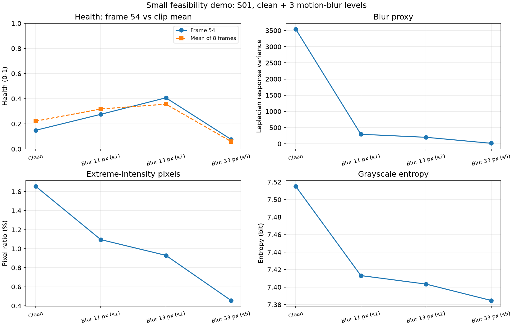
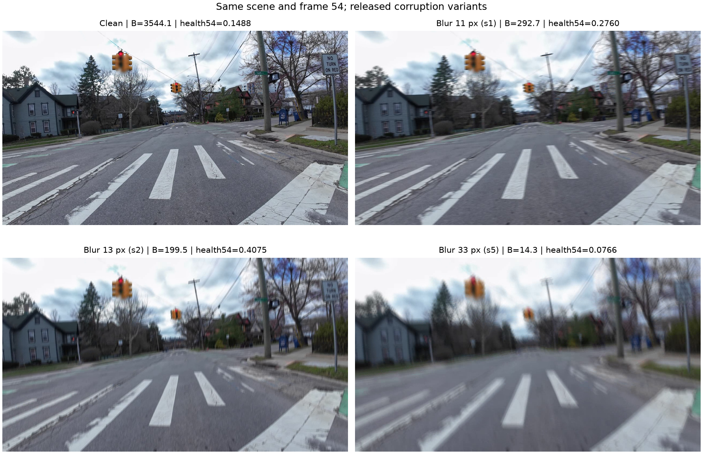

# Báo cáo LAB cá nhân — Lê Hưng

- **MSSV:** Chờ bổ sung trước khi nộp
- **Nhóm:** Seahorse, 4 người, được giảng viên chấp thuận theo thông tin đội trưởng.
- **Chủ đề:** T1 — Camera degradation health score; xe ADAS.
- **Vai trò được phân công:** Tài liệu; đối chiếu paper–code và trích dẫn.
- **Repository chung:** <https://github.com/luuquangkhai9/K4-Track4-Day04-Seahorse-Sensor-Reality-Sprint>.
- **Phạm vi:** Demo mới 4 clip S01, không phải benchmark mới 24 clip.

Bản này tổng hợp bằng chứng chung của nhóm. Vai trò trên là phân công; thành viên cần rà nội dung và bổ sung đóng góp thực tế của mình trước khi nộp.

## 1. Problem

Camera ADAS có thể vẫn hoạt động nhưng ảnh nhòe khiến đầu vào kém đáng tin. Nhóm kiểm tra: khi tăng mức motion blur trên cùng cảnh/frame, blur score và health score có giảm nhất quán không?

Giả thuyết gốc dự kiến B và health giảm; nhóm đã thấy ngoại lệ trong kết quả lịch sử và chọn mẫu có chủ đích để tái hiện. Đây là demo khả thi/failure case, không phải mẫu ngẫu nhiên cho đánh giá tổng quát. Baseline là clean của cùng cảnh, không chủ động thêm corruption.

## 2. Method

**[NGUỒN]** Bài camera reliability của Shiva Aher giới thiệu GSHI và EfficientNet-B2 nhiều nhánh. Bài DRIVE-C cung cấp video clean/corrupted có đối chứng và checkpoint baseline. Phương pháp chỉ cần RGB khi inference; depth thuộc bước tạo một số dữ liệu suy giảm.

**Triển khai nhóm dùng:** source tag v1.0.1, commit `caf16657b87cec8518008b74c72dd0dcb6088eb6`; checkpoint `epoch_021_best.pth`, SHA-256 `c210d9a4f207584687583d1ab5b96a99e12b2f3dbb2727464c6c039e44fb8c0b`. Model xuất `pred_health` từ nhánh trực tiếp; nhóm không thay nó bằng `gshi_gt`. Nhãn gshi_gt được tính từ severity, không phải health thật hoặc chất lượng detector. Xem [đối chiếu paper–code](../PAPER_CODE_MAPPING.md).

Chạy lại từ gốc repository:

```powershell
python scripts/stage3_small_demo.py --threads 4
```

[Hướng dẫn setup](../STAGE2_REPORT.md), [script](../scripts/stage3_small_demo.py), [cấu hình nhỏ](../configs/benchmark_small.json) và [manifest](../outputs/stage3_small/run_manifest.json) cho phép truy vết source/data/environment. Source và clip nằm trong cache; script chỉ tải các clip cần nếu thiếu.

## 3. Benchmark

Dùng DRIVE-C, DOI `10.5281/zenodo.19656444`: S01 clean và motion blur s1/s2/s5, kernel 11/13/33 px. Mỗi clip 128 frame. Health đo trên 8 frame index 0/18/36/54/73/91/109/127, tổng 32 output; model resize RGB về H=384/W=1280, chia 255, eval, không gradient.

B/S/H đo tại frame54 gốc 1280 × 720, RGB chuyển grayscale uint8:

- B = variance Laplacian CV_64F, ksize=1, ddof=0; phương sai đáp ứng trên thang pixel 0–255, proxy độ nét.
- S_pct = 100 × tỷ lệ gray ≤5 hoặc ≥250, đơn vị %; gồm pixel rất tối/rất sáng.
- H_bit = −Σ p log2(p), histogram 256 bin, bỏ p=0; đơn vị bit.
- Health frame54 và mean8 không đơn vị, thang 0–1, giữ riêng cách tổng hợp.

**[NHÓM ĐO]** Số mới lấy từ [CSV bốn clip](../outputs/stage3_small/benchmark_summary.csv), không phải số paper:

| Điều kiện | Kernel (px) | B | S_pct (%) | H_bit (bit) | Health f54 | Health mean8 |
| --- | ---: | ---: | ---: | ---: | ---: | ---: |
| Clean | Không thêm blur | 3544.1384 | 1.6558 | 7.5152 | 0.148770 | 0.221979 |
| Motion blur s1 | 11 | 292.6951 | 1.0954 | 7.4132 | 0.275987 | 0.318326 |
| Motion blur s2 | 13 | 199.4923 | 0.9299 | 7.4035 | 0.407456 | 0.356979 |
| Motion blur s5 | 33 | 14.2645 | 0.4564 | 7.3848 | 0.076573 | 0.059943 |


Chạy trên CPU 4 thread. Tổng forward là **7.20 giây**; toàn script lần đã cache khoảng **13.33 giây**, không gồm tải lần đầu. Sai lệch mean8 với metadata nguồn lớn nhất **0.000322928**, dưới ngưỡng cố định 0.001. Điều này xác nhận tái hiện gần số nguồn, không xác nhận model health chính xác.



## 4. Failure case

**[NHÓM ĐO]** S01 blur s2, frame54: B từ 3544.1384 xuống 199.4923 (**−94.37%**), nhưng health từ 0.148770 lên 0.407456 (**+0.258686**). Mean8 cũng tăng từ 0.221979 lên 0.356979 (**+0.135000**). Health không giảm đơn điệu trên ba mức s1/s2/s5 đã chọn.



Tác động tới tính năng giám sát: nếu chỉ xếp ảnh theo health, ảnh s2 được ưu tiên hơn clean trong trường hợp này. Ảnh hưởng tới detector là suy luận kỹ thuật, chưa được đo. **[GIẢ THUYẾT]** khác biệt cảnh/miền dữ liệu hoặc calibration có thể góp phần; chưa phân lập nguyên nhân.

Giới hạn: một cảnh; bốn ảnh metric; nhiều frame cùng clip không độc lập; không chạy s3/s4, cảnh đêm hoặc underexposure. Metadata thay nhiều tham số PSF cùng severity, không chỉ kernel. Mức được chọn sau khi xem kết quả lịch sử. Chưa có detector/mAP, cảnh báo sớm theo thời gian hoặc fusion.

## 5. Engineering decision

Đề xuất dùng health như tín hiệu bổ sung, log cùng B/S/H và đánh dấu bất đồng trước khi hiệu chỉnh ngưỡng giảm trọng số camera. Chưa dùng một ngưỡng health phổ quát hoặc tuyên bố quy tắc đa metric đã tốt hơn.

Trade-off: metric ảnh dễ tính nhưng phụ thuộc texture/exposure; health có thêm tín hiệu học được nhưng phản ứng bất nhất trên mẫu này. Vòng kiểm chứng sau: thêm nhiều cảnh, chọn ngưỡng trên tập hiệu chỉnh rồi đo cảnh báo nhầm/bỏ sót trên tập khác; bổ sung detector/nhãn nếu đánh giá tác động lên ADAS. Xem [quyết định kỹ thuật chung](../ENGINEERING_DECISION.md).

**Góc rà soát theo vai trò cá nhân:** Phần phụ trách rà soát là vai trò hai nguồn và khác biệt triển khai. Eq. 2/10 của paper phương pháp mô tả GSHI có cấu trúc; Eq. 12 có nhánh health trực tiếp. Source inference dùng pred_health của nhánh trực tiếp, công thức nhãn có beta/clipping, và training loss phát hành khác mô tả PDF. Vì vậy bản này mô tả checkpoint baseline DRIVE-C, chưa tuyên bố tái hiện mọi bảng thí nghiệm phương pháp.

**Đóng góp thực tế của tôi:** [Thành viên bổ sung việc đã thực hiện/kiểm tra và file hoặc commit tương ứng; không điền việc chưa làm.]

## Nguồn và bằng chứng

1. Shiva Aher, *Safety-Critical Camera Reliability Monitoring for ADAS via Degradation-Aware Uncertainty Pattern Analysis*, arXiv:2605.05439v1, 06/05/2026. Sections III–V trang 3–6: GSHI/architecture; Section VII trang 9: limitations. [PDF](<../Safety-Critical Camera Reliability Monitoring for ADAS via Degradation-Aware Uncertainty Pattern Analysis.pdf>).
2. Shiva Aher, *DRIVE-C: A Controlled Corruption Dataset for Autonomous Driving*, arXiv:2605.09774v1, 10/05/2026. Table 3 trang 7: baseline; trang 7–8: caveats. [PDF](<../DRIVE-C A Controlled Corruption Dataset for Autonomous Driving.pdf>).
3. [Source tag v1.0.1](https://github.com/shiv-aher/drive-c-dataset/tree/v1.0.1); [dataset DOI](https://doi.org/10.5281/zenodo.19656444).
4. [Health từng frame](../outputs/stage3_small/per_frame.csv), [monotonicity](../outputs/stage3_small/monotonicity.csv), [log](../outputs/stage3_small/run.log), [tham số PSF](../outputs/stage3_small/corruption_parameters.json).

Trước nộp: hoàn thiện MSSV nếu còn thiếu, ghi đóng góp thực tế, rà nội dung, nộp bản riêng này cùng URL repository trên VLearn và mở lại kiểm tra truy cập.
